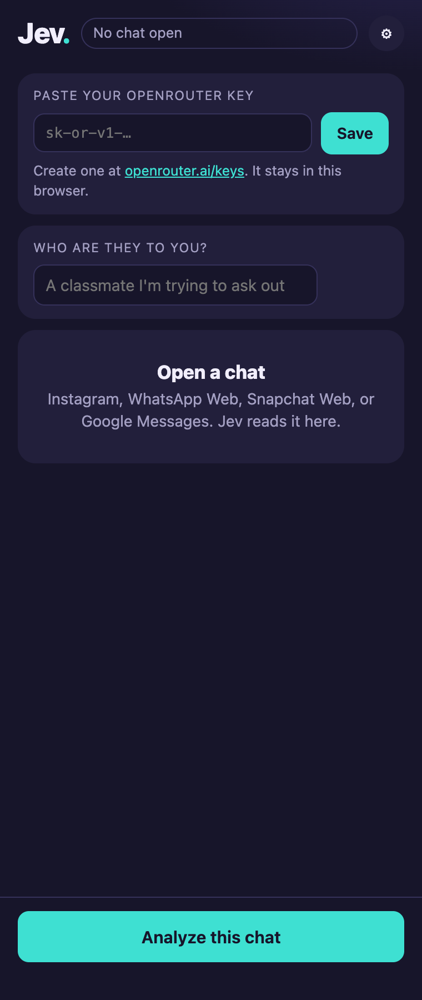
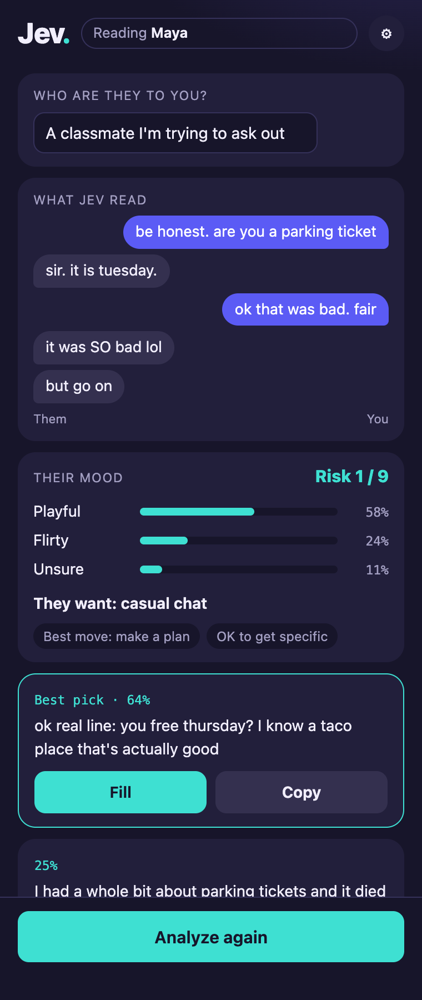

<div align="center">


# Jev Assistant

**Jev reads the open chat, judges what the other person wants, and suggests three replies. You choose one. Jev fills the box. You press send.**

<a href="https://github.com/zandy700/Jev-Assistant/raw/english-instagram-sms/docs/jev-assistant-extension.zip"></a>
&nbsp;
<a href="#set-up-on-mac"></a>

</div>

- **It judges before it writes.** The judge is TypeSafe's Jev model (`typesafe/jev-1.13`). It reads the other person's mood, intent, and risk, then ranks three replies written by a second model. The app is named after that judge.
- **It knows who is who.** Messages on the right are yours. Messages on the left are theirs.
- **It never sends.** Fill puts a reply in the message box, or copies it. You press Send yourself.
- **It uses one OpenRouter key.** Jev Assistant has no server. [OpenRouter](https://openrouter.ai/) hosts the Jev model, so the same key pays for the judge and the reply drafts. The call happens only when you analyze a chat.

## Demo

About fourteen seconds on a Mac. He tries a parking-ticket line and she is not impressed. He picks **Analyze now** from the Jev menu, reads her three moods, and fills the safer reply. She softens, he analyzes again, and Jev finds a warmer mood and a real plan. He presses send himself.


[Play the video](docs/demo.mp4)

## Contents

- [Set up on Mac](#set-up-on-mac)
  - [Menu-bar app](#option-1-menu-bar-app)
  - [Chrome extension](#option-2-chrome-extension-on-mac)
- [Set up on Windows](#set-up-on-windows)
  - [Chrome extension (recommended)](#chrome-extension-recommended)
  - [Alternatives: Jev bookmark or Read a window](#alternatives)
- [FAQ](#faq)

## Set up on Mac

There are two ways to use Jev on a Mac. Both need an OpenRouter key. If you don't have one, create it at [openrouter.ai/keys](https://openrouter.ai/keys) with **Create Key**. It starts with `sk-or-v1-`. Set a credit limit there so it can't overspend. That key is the only one to create: OpenRouter hosts TypeSafe's Jev judge (`typesafe/jev-1.13`), so it covers the judge and the reply drafts.

| Way | Reads | Fills the message box | Needs Chrome Developer mode |
|---|---|---|---|
| [Menu-bar app](#option-1-menu-bar-app) | Apple Messages, WhatsApp Desktop, and any chat in Chrome or Firefox | Yes | No |
| [Chrome extension](#option-2-chrome-extension-on-mac) | Instagram, WhatsApp Web, Snapchat Web, and Google Messages in Chrome | Yes | Yes |

### Option 1: Menu-bar app

Requirements: macOS 14 or newer. For SMS threads, turn on Text Message Forwarding on your iPhone.

**1. Build and open the app.**

```bash
bash mac/package.sh
```

Open `mac/build/Jev Assistant.app`. A **Jev** item appears in the menu bar.

<p align="center">
  <br/>
  <em>Build with <code>bash mac/package.sh</code>, then open <code>mac/build/Jev Assistant.app</code></em>
</p>

**2. Allow it to read the screen.** Open System Settings → Privacy & Security and turn on **Jev Assistant** under both:

- **Accessibility**, for Messages and WhatsApp Desktop.
- **Screen Recording**, for chats in Chrome or Firefox.

Each rebuild resets these. If Jev stops reading after a rebuild, turn it off and on again in both lists.

**3. Save your OpenRouter key.** Menu bar **Jev** → **Set Judge API key…** → paste → **Save**. Leave **Set Reply API key** empty. It reuses the same key.

<p align="center">
  <br/>
  <em>Jev → Set Judge API key… (fictional key shown)</em>
</p>

**4. Optional: say who they are to you.** **Jev** → **Set relationship…**, for example "A classmate I'm trying to ask out."

<p align="center">
  <br/>
  <em>Jev → Set relationship… (fictional text only)</em>
</p>

**5. Analyze a chat.** Open a chat, leave it in front, and choose **Jev** → **Analyze now**. The panel shows the risk, three moods, and three ranked replies. **Fill** puts a reply in the message box.

<p align="center">
  <br/>
  <em>The Mac panel (fictional chat)</em>
</p>

### Option 2: Chrome extension on Mac

Use this if you only chat in Chrome and don't want to build the app. It reads Instagram, WhatsApp Web, Snapchat Web, and Google Messages. It can't read Apple Messages or WhatsApp Desktop.

<a href="https://github.com/zandy700/Jev-Assistant/raw/english-instagram-sms/docs/jev-assistant-extension.zip"></a>

1. **Unzip it.** Double-click the zip in Downloads. You get a folder named `jev-assistant-extension`.
2. **Load it in Chrome.** Go to `chrome://extensions`, turn on **Developer mode**, click **Load unpacked**, and select that folder.
3. **Open Jev.** Click the puzzle piece in Chrome's toolbar, pin **Jev Assistant**, then click the Jev icon. The side panel opens.
4. **Set it up in the panel.** Paste your OpenRouter key at the top and click **Save**. Fill in **Who are they to you?** It saves as you type.
5. **Analyze a chat.** Open a chat and click **Analyze this chat**. **Fill** puts a reply in the message box.

## Set up on Windows

On Windows, use the Chrome extension. It reads Instagram, WhatsApp Web, Snapchat Web, and Google Messages, and **Fill** puts the reply in the message box. It also works on Linux. If you can't use it, see the [alternatives](#alternatives) below.

You need an OpenRouter key. If you don't have one, create it at [openrouter.ai/keys](https://openrouter.ai/keys) with **Create Key**. It starts with `sk-or-v1-`. Set a credit limit there so it can't overspend. That key is the only one to create: OpenRouter hosts TypeSafe's Jev judge (`typesafe/jev-1.13`), so it covers the judge and the reply drafts.

### Chrome extension (recommended)

<a href="https://github.com/zandy700/Jev-Assistant/raw/english-instagram-sms/docs/jev-assistant-extension.zip"></a>

Click the button and the zip downloads. Jev is not in the Chrome Web Store yet, so Chrome loads it with Developer mode on.

1. **Unzip it.** Right-click the zip → **Extract All**. You get a folder named `jev-assistant-extension` with `manifest.json` directly inside.
2. **Load it in Chrome.** Go to `chrome://extensions`, turn on **Developer mode** in the top right, click **Load unpacked**, and select the `jev-assistant-extension` folder.

   <p align="center">
     <br/>
     <em>Developer mode → Load unpacked → select the <code>jev-assistant-extension</code> folder</em>
   </p>

3. **Open Jev.** Click the puzzle piece in Chrome's toolbar, pin **Jev Assistant**, then click the Jev icon. The side panel opens.
4. **Save your OpenRouter key in the panel.** Paste it at the top and click **Save**.

   <p align="center">
     <br/>
     <em>The side panel before a key is saved</em>
   </p>

5. **Optional: say who they are to you.** Type it into **Who are they to you?** in the panel. It saves as you type.
6. **Analyze a chat.** Open a chat and click **Analyze this chat**. The panel shows what Jev read, their mood, and three replies. **Fill** puts one in the message box.

   <p align="center">
     <br/>
     <em>The side panel after Analyze (fictional chat)</em>
   </p>

The gear in the panel holds your key, auto-analyze, and a link to model settings. If Chrome turns the extension off after an update, turn it back on in `chrome://extensions`.

<details>
<summary><b>Firefox instead of Chrome</b></summary>

Open `about:debugging#/runtime/this-firefox`, click **Load Temporary Add-on…**, and pick `manifest.json` inside the unzipped `jev-assistant-extension` folder. Click the Jev icon to open the sidebar, then paste the key there. Firefox removes a temporary add-on when it quits, so load it again after a restart.

<p align="center">
  <br/>
  <em>Firefox: Load Temporary Add-on… → <code>manifest.json</code></em>
</p>

</details>

### Alternatives

Use one of these if you can't turn on Developer mode in Chrome. Neither one fills the message box. You copy the reply and paste it yourself. Each keeps its own copy of your key, saved on [the Jev page](https://zandy700.github.io/Jev-Assistant/use.html).

#### Jev bookmark

No install. Works in Chrome or Edge on Instagram, WhatsApp Web, Snapchat Web, and Google Messages.

1. Open [the Jev page](https://zandy700.github.io/Jev-Assistant/use.html).
2. **Save your OpenRouter key** in step 1 on that page. The box closes and shows the last four characters.
3. Press **Ctrl+Shift+B** to show the bookmarks bar, then drag the purple **Jev** tag at the top of the page onto it.
4. Open a chat and click the **Jev** bookmark.

A Jev tab opens with the chat as bubbles, the moods, and three replies. Click **Copy**, go back to the chat, and press **Ctrl+V**. To say who they are to you, open **Other ways, and who they are to you** at the bottom of the Jev page.

#### Read a window

Use this for any other chat window. On [the Jev page](https://zandy700.github.io/Jev-Assistant/use.html), save your key, open **Other ways, and who they are to you**, and click **Read a window**. Pick the chat window from the list. Jev reads one picture of it and doesn't keep it.

## FAQ

<details>
<summary><b>Why is it called Jev, and which API key do I need?</b></summary>

Jev is TypeSafe's judgment model, `typesafe/jev-1.13`. It answers structured questions about mood, intent, and risk, then ranks the three drafts. A normal chat model writes the reply text.

OpenRouter hosts that model. One OpenRouter key (`sk-or-v1-…`), created at [openrouter.ai/keys](https://openrouter.ai/keys), pays for the judge call and the draft call. A TypeSafe account is only for advanced settings, if you point the judge URL at TypeSafe yourself. The default setup stays on OpenRouter.

</details>

<details>
<summary><b>Will it send messages for me?</b></summary>

No. Fill only puts the reply in the message box. You press send.

</details>

<details>
<summary><b>Where does the chat text go?</b></summary>

Only to OpenRouter, with your key, when you analyze. Jev has no server of its own.

</details>

<details>
<summary><b>Should I use the app or the Chrome extension on a Mac?</b></summary>

The menu-bar app reads more: Apple Messages, WhatsApp Desktop, and any chat in Chrome or Firefox. Use the [Chrome extension](#option-2-chrome-extension-on-mac) if you only chat in Chrome and don't want to build the app. You don't need both.

</details>

<details>
<summary><b>Why does the Chrome extension need Developer mode?</b></summary>

Chrome only installs extensions without Developer mode when they come from the Chrome Web Store, and Jev isn't listed there yet. The Jev bookmark works without it.

</details>

<details>
<summary><b>Does it cost money?</b></summary>

Jev is free. OpenRouter charges for the model calls on your key. Set a credit limit when you create the key.

</details>

<details>
<summary><b>It says the key needs more credit.</b></summary>

Add credit at [openrouter.ai/settings/credits](https://openrouter.ai/settings/credits), or switch to a `:free` model.

</details>

<details>
<summary><b>Can I use it on my phone?</b></summary>

**Android** (11 or newer): download [the APK](apk/jev-assistant-v1.3-release.apk) on the phone and open it. Paste the key in Settings → Judge API, then turn on **Accessibility** and **Display over other apps**. This APK is the older v1.3 build without mood or the WhatsApp and Snapchat readers. For those, build from source with `./gradlew assembleDebug`.

**iPhone** doesn't let apps read other apps' chats. Open [the Jev page](https://zandy700.github.io/Jev-Assistant/use.html) in Safari, open **Other ways**, paste the chat with `Me:` and `Her:` lines, and copy a reply back.

</details>

<details>
<summary><b>What do the risk, mood, and reply rankings mean?</b></summary>

- **Risk** is 0 to 9. Green is safe, amber means careful, red means a wrong reply could hurt.
- **Mood** shows the three most likely moods, highest first, each with a percent, for example `Angry 70%`, `Furious 20%`, `Frustrated 10%`. The latest message counts most.
- **What they want** is the model's read of their intent.
- **Replies** are ranked. The top one is the model's pick.

The default models are paid OpenRouter models. To spend less, pick a model id ending in `:free` in settings.

</details>

<details>
<summary><b>Which chats does it read?</b></summary>

| Chat | Mac | Windows | Android |
|---|---|---|---|
| iMessage / SMS | Apple Messages | Google Messages for web | Google Messages |
| WhatsApp | WhatsApp Desktop, WhatsApp Web | WhatsApp Web | WhatsApp |
| Instagram | instagram.com Direct | instagram.com Direct | Instagram |
| Snapchat | Snapchat Web | Snapchat Web | Snapchat |
| QQ, X, Feishu | | | Yes |
| Any other chat | | Read a window | Read screen once, which can't tell who sent what |

Jev only reads chats already open on your own device.

</details>

<details>
<summary><b>How is a suggestion made?</b></summary>

```
open chat  →  read the recent messages (right side = you)
           →  Jev (typesafe/jev-1.13 on OpenRouter) judges mood, intent, and risk
           →  a chat model drafts 3 replies
           →  Jev ranks those 3
           →  show them
           →  Fill writes the box
           →  you send
```

One reader per app or site turns the window into a list of who said what. Everything after that is shared. To add an Android chat app, implement `ChatAppAdapter` in `app/src/main/java/com/jev/probe/capture/` and register it in `ChatCaptureService`.

</details>

<details>
<summary><b>What doesn't it do well yet?</b></summary>

- The Android APK is v1.3 and lacks mood and the WhatsApp and Snapchat readers. Build from source for those.
- Group chats are read as if they were one-to-one.
- Screen reading only sees what's on screen. Windows marked secure can't be captured.
- Each Mac rebuild resets Accessibility and Screen Recording.
- Firefox temporary add-ons disappear when Firefox quits.

</details>

## License

Code is under [MIT](LICENSE). See also [NOTICE](NOTICE).

This project only handles chats on your own device that you already have the right to view. Follow each app's terms and local law.
