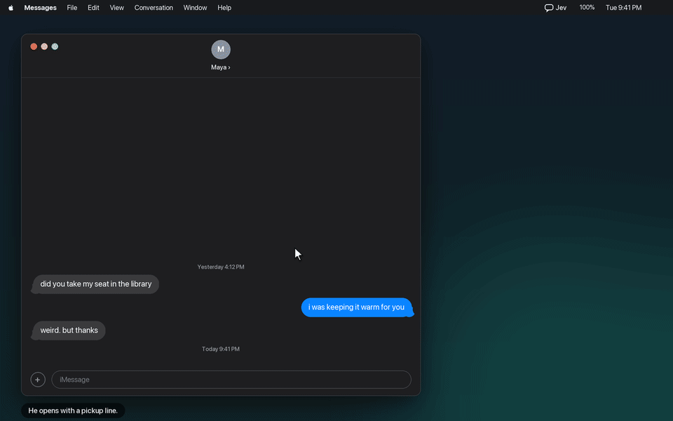
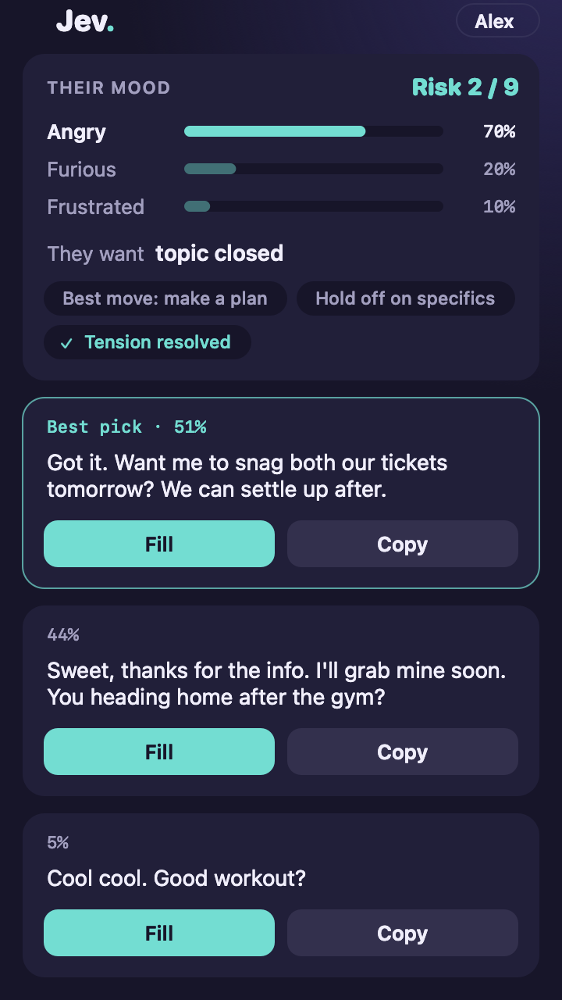

<div align="center">


# Jev Assistant

**Jev reads the open chat, judges what the other person wants, and suggests three replies. You choose one. Jev fills the box. You press send.**

</div>

## Demo

About fourteen seconds on a Mac. He tries a parking-ticket line and she is not impressed. He picks **Analyze now** from the Jev menu, reads her three moods, and fills the safer reply. She softens, he analyzes again, and Jev finds a warmer mood and a real plan. He presses send himself.



[Play the video](docs/demo.mp4)

## Contents

- [What Jev does](#what-jev-does)
- [Set up on Mac](#set-up-on-mac)
- [Set up on Windows](#set-up-on-windows)
  - [Chrome extension](#option-1-chrome-extension)
  - [Jev bookmark](#option-2-jev-bookmark)
  - [Read a window](#option-3-read-a-window)
- [Phones](#phones)
- [What the results mean](#what-the-results-mean)
- [Supported chats](#supported-chats)
- [How a suggestion is made](#how-a-suggestion-is-made)
- [FAQ](#faq)
- [Limitations](#limitations)
- [License](#license)

## What Jev does

- **It judges before it writes.** One model reads the other person's mood, intent, and risk. A second model drafts three replies. The first model ranks them.
- **It knows who is who.** Messages on the right are yours. Messages on the left are theirs.
- **It never sends.** Fill puts a reply in the message box, or copies it. You press Send yourself.
- **It uses your key.** Jev has no server. It calls [OpenRouter](https://openrouter.ai/) with your key, only when you analyze a chat.

Every setup below needs one OpenRouter key. Create it at [openrouter.ai/keys](https://openrouter.ai/keys) with **Create Key**. It starts with `sk-or-v1-`. Set a credit limit on the same page so it can't overspend.

## Set up on Mac

On a Mac, Jev is a menu-bar app. It reads Apple Messages and WhatsApp Desktop directly. For Instagram, WhatsApp Web, Snapchat Web, or Google Messages in Chrome or Firefox, it reads the window in front when you click **Analyze now**. You don't need the Chrome extension on a Mac.

Requirements: macOS 14 or newer. For SMS threads, turn on Text Message Forwarding on your iPhone.

**1. Build and open the app.**

```bash
bash mac/package.sh
```

Open `mac/build/Jev Assistant.app`. A **Jev** item appears in the menu bar.

<p align="center">
  <br/>
  <em>Build with <code>bash mac/package.sh</code>, then open <code>mac/build/Jev Assistant.app</code></em>
</p>

**2. Allow it to read the screen.** Open System Settings → Privacy & Security and turn on **Jev Assistant** under both:

- **Accessibility**, for Messages and WhatsApp Desktop.
- **Screen Recording**, for chats in Chrome or Firefox.

Each rebuild resets these. If Jev stops reading after a rebuild, turn it off and on again in both lists.

**3. Save your OpenRouter key.** Menu bar **Jev** → **Set Judge API key…** → paste → **Save**. Leave **Set Reply API key** empty. It reuses the same key.

<p align="center">
  <br/>
  <em>Jev → Set Judge API key… (fictional key shown)</em>
</p>

**4. Optional: say who they are to you.** **Jev** → **Set relationship…**, for example "A classmate I'm trying to ask out."

<p align="center">
  <br/>
  <em>Jev → Set relationship… (fictional text only)</em>
</p>

**5. Analyze a chat.** Open a chat, leave it in front, and choose **Jev** → **Analyze now**. The panel shows the risk, three moods, and three ranked replies. **Fill** puts a reply in the message box.

<p align="center">
  <br/>
  <em>The Mac panel (fictional chat)</em>
</p>

## Set up on Windows

There are three ways to use Jev on Windows. Each one keeps its own saved key, so paste your key into whichever you use.

| Way | What you do | Fills the message box | Needs Chrome Developer mode |
|---|---|---|---|
| [Chrome extension](#option-1-chrome-extension) | Click the Jev icon next to the chat | Yes | Yes |
| [Jev bookmark](#option-2-jev-bookmark) | Click a bookmark on the chat | No, you copy the reply | No |
| [Read a window](#option-3-read-a-window) | Pick the chat window from a share list | No, you copy the reply | No |

The extension and the bookmark read Instagram, WhatsApp Web, Snapchat Web, and Google Messages. Read a window works on any chat window. The Chrome extension also works on Linux.

### Option 1: Chrome extension

**Download the extension: [jev-assistant-extension.zip](https://github.com/zandy700/Jev-Assistant/raw/english-instagram-sms/docs/jev-assistant-extension.zip)**

Jev is not in the Chrome Web Store yet, so Chrome loads it with Developer mode on.

1. **Unzip it.** Right-click the zip → **Extract All**. You get a folder named `extension` with `manifest.json` inside.
2. **Load it in Chrome.** Go to `chrome://extensions`, turn on **Developer mode** in the top right, click **Load unpacked**, and select the `extension` folder.

   <p align="center">
     <br/>
     <em>Developer mode → Load unpacked → select the <code>extension</code> folder</em>
   </p>

3. **Save your OpenRouter key.** On `chrome://extensions`, click **Details** on Jev Assistant → **Extension options**. Paste the key into **Judge API key** and save. Leave the Reply key blank.

   <p align="center">
     <br/>
     <em>Extension options: paste into Judge API key</em>
   </p>

4. **Optional: say who they are to you.** In the same options page, fill in **Who is the other person to you?**
5. **Pin the icon.** Click the puzzle piece in Chrome's toolbar and pin **Jev Assistant**.
6. **Analyze a chat.** Open a chat, then click the Jev icon. The side panel shows the moods and three replies. **Fill** puts one in the message box.

If Chrome turns the extension off after an update, turn it back on in `chrome://extensions`.

<details>
<summary><b>Firefox instead of Chrome</b></summary>

Open `about:debugging#/runtime/this-firefox`, click **Load Temporary Add-on…**, and pick `manifest.json` inside the unzipped `extension` folder. Save the key under Extensions → Jev Assistant → Options. Firefox removes a temporary add-on when it quits, so load it again after a restart.

<p align="center">
  <br/>
  <em>Firefox: Load Temporary Add-on… → <code>manifest.json</code></em>
</p>

</details>

### Option 2: Jev bookmark

No install and no Developer mode. Use Chrome or Edge.

1. Open [the Jev page](https://zandy700.github.io/Jev-Assistant/use.html).
2. **Save your OpenRouter key** in step 1 on that page. The box closes and shows the last four characters.
3. Press **Ctrl+Shift+B** to show the bookmarks bar, then drag the purple **Jev** tag at the top of the page onto it.
4. Open a chat and click the **Jev** bookmark.

A Jev tab opens with the chat as bubbles, the moods, and three replies. Click **Copy**, go back to the chat, and press **Ctrl+V**. To say who they are to you, open **Other ways, and who they are to you** at the bottom of the Jev page.

### Option 3: Read a window

Use this for a chat the bookmark can't read. On [the Jev page](https://zandy700.github.io/Jev-Assistant/use.html), save your key, open **Other ways, and who they are to you**, and click **Read a window**. Pick the chat window from the list. Jev reads one picture of it and doesn't keep it.

## Phones

**Android** (11 or newer): download [the APK](apk/jev-assistant-v1.3-release.apk) on the phone and open it. Paste the key in Settings → Judge API, then turn on **Accessibility** and **Display over other apps**. This APK is the older v1.3 build without mood or the WhatsApp and Snapchat readers. For those, build from source with `./gradlew assembleDebug`.

**iPhone** doesn't let apps read other apps' chats. Open [the Jev page](https://zandy700.github.io/Jev-Assistant/use.html) in Safari, open **Other ways**, paste the chat with `Me:` and `Her:` lines, and copy a reply back.

## What the results mean

- **Risk** is 0 to 9. Green is safe, amber means careful, red means a wrong reply could hurt.
- **Mood** shows the three most likely moods, highest first, each with a percent, for example `Angry 70%`, `Furious 20%`, `Frustrated 10%`. The latest message counts most.
- **What they want** is the model's read of their intent.
- **Replies** are ranked. The top one is the model's pick.

The default models are paid OpenRouter models. To spend less, pick a model id ending in `:free` in settings.

## Supported chats

| Chat | Mac | Windows | Android |
|---|---|---|---|
| iMessage / SMS | Apple Messages | Google Messages for web | Google Messages |
| WhatsApp | WhatsApp Desktop, WhatsApp Web | WhatsApp Web | WhatsApp |
| Instagram | instagram.com Direct | instagram.com Direct | Instagram |
| Snapchat | Snapchat Web | Snapchat Web | Snapchat |
| QQ, X, Feishu | | | Yes |
| Any other chat | | Read a window | Read screen once, which can't tell who sent what |

Jev only reads chats already open on your own device.

## How a suggestion is made

```
open chat  →  read the recent messages (right side = you)
           →  judge mood, intent, and risk
           →  draft 3 replies
           →  rank those 3
           →  show them
           →  Fill writes the box
           →  you send
```

One reader per app or site turns the window into a list of who said what. Everything after that is shared.

<details>
<summary><b>Add another Android chat app</b></summary>

1. Implement `ChatAppAdapter` in `app/src/main/java/com/jev/probe/capture/`. `pkg` is the package name. `extract` returns the title and messages, or `null` when the screen is not a chat.
2. Register it in `ChatCaptureService`.
3. Judgment, ranking, the overlay, and Fill stay as they are.

</details>

## FAQ

<details>
<summary><b>Will it send messages for me?</b></summary>

No. Fill only puts the reply in the message box. You press send.

</details>

<details>
<summary><b>Where does the chat text go?</b></summary>

Only to OpenRouter, with your key, when you analyze. Jev has no server of its own.

</details>

<details>
<summary><b>Does a Mac need the Chrome extension?</b></summary>

No. The menu-bar app reads Chrome and Firefox chats on a Mac. The extension is for Windows and Linux.

</details>

<details>
<summary><b>Why does the Chrome extension need Developer mode?</b></summary>

Chrome only installs extensions without Developer mode when they come from the Chrome Web Store, and Jev isn't listed there yet. The Jev bookmark works without it.

</details>

<details>
<summary><b>Does it cost money?</b></summary>

Jev is free. OpenRouter charges for the model calls on your key. Set a credit limit when you create the key.

</details>

<details>
<summary><b>It says the key needs more credit.</b></summary>

Add credit at [openrouter.ai/settings/credits](https://openrouter.ai/settings/credits), or switch to a `:free` model.

</details>

## Limitations

- The Android APK is v1.3 and lacks mood and the WhatsApp and Snapchat readers. Build from source for those.
- Group chats are read as if they were one-to-one.
- Screen reading only sees what's on screen. Windows marked secure can't be captured.
- Each Mac rebuild resets Accessibility and Screen Recording.
- Firefox temporary add-ons disappear when Firefox quits.

## License

Code is under [MIT](LICENSE). See also [NOTICE](NOTICE).

This project only handles chats on your own device that you already have the right to view. Follow each app's terms and local law.
